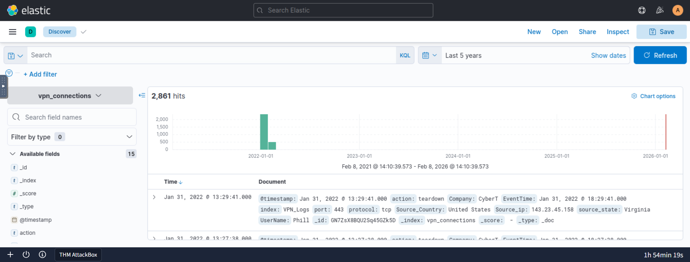

# Elastic Stack SIEM Basics

This repository documents my hands-on experience using the Elastic Stack (ELK) for security monitoring, log analysis, and threat investigation.

## Platform

TryHackMe

## Module

Elastic Stack: The Basics

## Skills Developed

- Log analysis using Elastic Stack
- Security event investigation
- VPN log analysis
- Threat detection techniques
- Kibana Discover usage
- KQL (Kibana Query Language) queries
- Time-based log analysis
- Visualization and dashboard creation
- Event correlation and filtering

## Tools Used

- Elastic Stack (ELK)
- Kibana Discover
- Kibana Visualize
- Kibana Dashboards

## Investigation Activities

- Identified suspicious IP activity
- Analyzed VPN connection logs
- Filtered logs based on country, IP, and user
- Investigated failed connection attempts
- Built visualizations for log analysis
- Created security dashboards


```kql
Source_Country: "United States"



